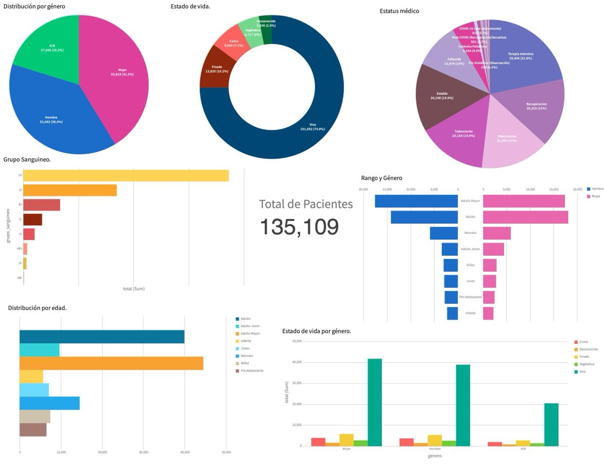
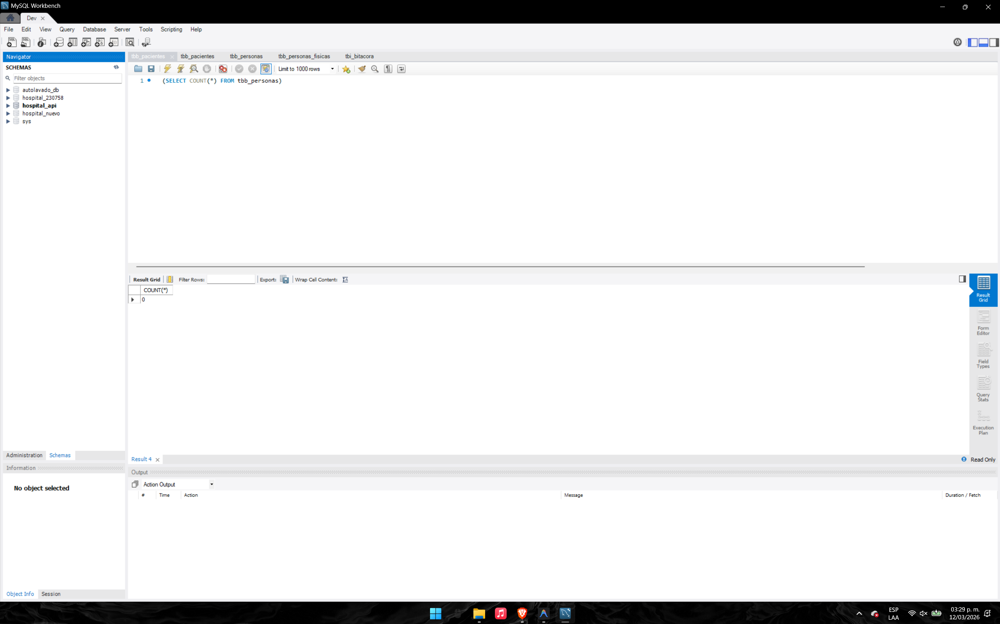
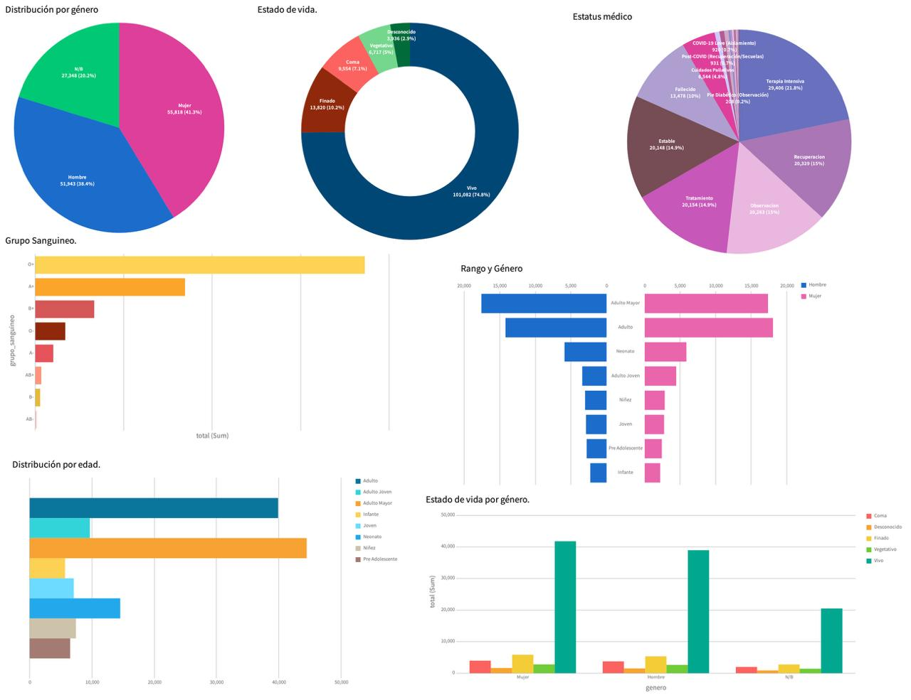

# Documentación y Pruebas (api/test)

=============================================================================
- **Nombre del archivo:** README.md
- **Descripción del archivo:** Documentación general y resultados de las pruebas de inyección masiva en la API.
- **Creado por:** Agente AI Antigravity
- **Adaptado por:** Angel de Jesus Baños Tellez
- **Supervisado por:** 
=============================================================================

# 🏥 ABD Hospital MD API - Documentación y Pruebas

API para la gestión y análisis de datos médicos hospitalarios.

Este servicio permite consultar y procesar información relacionada con pacientes, incluyendo distribución demográfica, estado clínico y métricas relevantes para análisis hospitalario. El objetivo es centralizar los datos para su consumo por aplicaciones frontend, dashboards analíticos y sistemas de gestión hospitalaria.

### DASHBOARD CON DATOS DEL API

_Figura 1: Vista del dashboard interactuando con los nuevos endpoints de la API._

---

## 📊 Características del sistema

La API permite obtener información para visualizar métricas como:
- Distribución de pacientes por **género**
- Distribución por **edad**
- **Estado de vida** del paciente
- **Estatus médico**
- Distribución por **grupo sanguíneo**
- Relación entre **edad y género**
- Relación entre **estado de vida y género**

Estos datos pueden ser consumidos por dashboards analíticos para apoyar la toma de decisiones médicas y administrativas.

---

## 📈 Visualización de datos

El sistema permite generar paneles analíticos que muestran:
- Distribución por género
- Estado de vida
- Estatus médico
- Grupos sanguíneos
- Rango de edad por género
- Estado de vida por género

Estas visualizaciones permiten interpretar de forma clara grandes volúmenes de información clínica.

---

## 🧠 Métricas disponibles

### Distribución por género
Permite analizar la proporción de pacientes: Hombre, Mujer, No especificado (N/B).

### Estado de vida
Clasificación del estado actual del paciente: Vivo, Fallecido, Coma, Estado vegetativo, Desconocido.

### Estatus médico
Seguimiento del tratamiento o condición médica: Estable, Observación, Recuperación, Tratamiento, Terapia intensiva, Cuidados paliativos, COVID-19 (aislamiento), Post-COVID, Pre-diabetes, Diabético.

### Grupo sanguíneo
Distribución de pacientes según su tipo de sangre: O+, A+, B+, O-, A-, AB+, B-, AB-.

### Distribución por edad
Segmentación de pacientes en rangos como: Neonato, Infante, Niñez, Pre-adolescente, Joven, Adulto joven, Adulto, Adulto mayor.

---

## 🧪 Pruebas de Carga e Inyección Masiva de Datos

Este documento detalla las pruebas de inyección masiva de datos realizadas para validar la robustez y capacidad de respuesta de la API y la base de datos MySQL (con Swagger UI).

### Resumen de Ejecución
Se realizaron **10 pruebas** consecutivas con diferentes parámetros de volumen, género, edad y condiciones médicas.

- **Contador Inicial:** 0 registros.
- **Contador Final:** 135,109 registros totales procesados.

### Estado Inicial del Sistema
Antes de comenzar las pruebas, se verificó que las tablas de pacientes estuvieran vacías (consulta COUNT en `tbb_personas` en MySQL Workbench) para asegurar la limpieza de los datos de prueba.

_Figura 2: Contador en 0 antes de iniciar las pruebas._

---

### Detalle de las 10 Pruebas

#### Prueba 1: Inyección Masiva Base (100,000 registros)
- **Cantidad:** 100,000 registros
- **Filtros:** Ninguno (aleatorio)
- **Objetivo:** Validar la capacidad de inserción masiva en una sola transacción.

_Figura 3: Ejecución de la Prueba 1 con 100,000 registros._

#### Prueba 2: Segmento Femenino Adulto
- **Cantidad:** 5,000 registros
- **Género:** Mujer
- **Rango de Edad:** 20 - 50 años / 20 - 25 años
- **Objetivo:** Inyectar datos específicos de pacientes femeninos en edad laboral.

_Figura 4: Ejecución de la Prueba 2 para el segmento femenino adulto._

#### Prueba 3: Pacientes Discapacitados
- **Cantidad:** 300 registros
- **Género:** Hombre
- **Rango de Edad:** 7 - 11 años
- **Condición:** Discapacitado
- **Objetivo:** Probar la flag de condición especial en pacientes masculinos.

_Figura 5: Ejecución de la Prueba 3 de pacientes discapacitados._

#### Prueba 4: Pacientes Neonatos
- **Cantidad:** 1,500 registros
- **Rango de Edad:** 0 - 0 años
- **Objetivo:** Generar registros de recién nacidos para pruebas de pediatría.

_Figura 6: Ejecución de la Prueba 4 para pacientes neonatos._

#### Prueba 5: Casos de Fallecimiento
- **Cantidad:** 325 registros
- **Estatus Vida:** Finado
- **Objetivo:** Validar la lógica de estados de vida en la base de datos.

_Figura 7: Ejecución de la Prueba 5 con casos de fallecimiento._

#### Prueba 6: Segmento Diabético
- **Cantidad:** 832 registros
- **Rango de Edad:** 5 - 22 años
- **Condición:** Diabético
- **Objetivo:** Inyectar pacientes jóvenes con condiciones crónicas.

_Figura 8: Ejecución de la Prueba 6 para el segmento diabético._

#### Prueba 7: Segmento Pediátrico Masculino
- **Cantidad:** 625 registros
- **Género:** Hombre
- **Rango de Edad:** 1 - 14 años
- **Condición:** Pediátrico
- **Objetivo:** Validar la categorización automática de edad en el rango infantil.

_Figura 9: Ejecución de la Prueba 7 para el segmento pediátrico masculino._

#### Prueba 8: Casos de Coma
- **Cantidad:** 111 registros
- **Estatus Vida:** Coma
- **Objetivo:** Probar estados críticos de salud.

_Figura 10: Ejecución de la Prueba 8 con casos de pacientes en coma._

#### Prueba 9: Diversidad de Género (N/B)
- **Cantidad:** 23,000 registros
- **Género:** N/B
- **Objetivo:** Validar la inclusión de identidades no binarias en el sistema.

_Figura 11: Ejecución de la Prueba 9 sobre diversidad de género (N/B)._

#### Prueba 10: Contingencia COVID
- **Cantidad:** 3,416 registros
- **Condición:** COVID
- **Objetivo:** Simular carga de datos durante una emergencia sanitaria.

_Figura 12: Ejecución de la Prueba 10 de contingencia por COVID._

---

### Detalles Adicionales y Verificación

#### Ejecución y Respuesta de la API (Swagger)
Ejecución de ruta `/api/poblar` y uso de CORS en la API para permitir su consumo en diferentes dispositivos en la misma red.

_Figura 13: Ejecución de la ruta /api/poblar en Swagger UI._

#### Bitácora de Operaciones (tbb_bitacora)
Registro de auditoría y operaciones almacenadas en base de datos.

_Figura 14: Registro de operaciones en la tabla tbb_bitacora._

#### Resultado Final de las Pruebas
Tras completar las 10 ejecuciones, el sistema procesó un total de **135,109** registros exitosamente, reflejados en la tabla `tbb_personas`.

_Figura 15: Verificación final del volumen de datos en MySQL Workbench._

---

### DASHBOARD PREVIO A ACTUALIZACION DEL API

_Figura 16: Vista del dashboard en su versión anterior a la actualización de la API._
